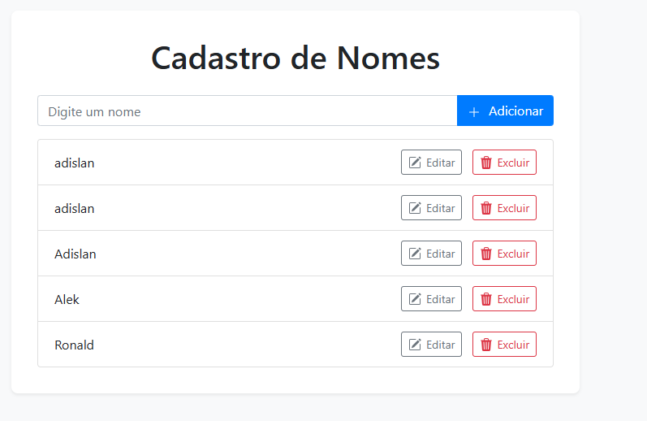

# CRUD Simples com HTML, CSS e JavaScript

Este é um projeto de CRUD (Create, Read, Update, Delete) simples, desenvolvido como exemplo prático utilizando as tecnologias web fundamentais: HTML para a estrutura, CSS para a estilização e JavaScript para a interatividade e manipulação dos dados.

## Visão Geral

O objetivo deste projeto é demonstrar as operações básicas de um CRUD, permitindo que os usuários:

*   **C**riem novos registros.
*   **R**ecuperem (leiam) os registros existentes.
*   **A**tualizem os registros existentes.
*   **D**eletem registros existentes.

Este projeto foi utilizado em aula e está disponível aqui para consulta e aprendizado.

## Como Funciona

O sistema manipula uma lista de nomes. As funcionalidades são implementadas da seguinte forma:

*   **HTML (`index.html`)**: Define a estrutura da página, incluindo o formulário para entrada de dados e a área onde os dados são exibidos.
*   **CSS (`style.css` - *se aplicável*)**: Provê a estilização visual para a página, tornando a interface mais agradável.
*   **JavaScript (`script.js` - *se aplicável*)**: Controla toda a lógica da aplicação. Ele lida com:
    *   Captura de dados do formulário.
    *   Adição de novos nomes à lista.
    *   Exibição dos nomes na tela.
    *   Edição de nomes existentes.
    *   Remoção de nomes da lista.
    *   (Opcional: se estiver usando) Interação com o `localStorage` do navegador para persistir os dados, para que não sejam perdidos ao recarregar a página.

## Como Usar

1.  Clone este repositório: `git clone <URL_DO_SEU_REPOSITORIO>`
2.  Abra o arquivo `index.html` em seu navegador de preferência.
3.  Utilize a interface para adicionar, visualizar, editar e remover nomes.

## Estrutura de Tabela (Exemplo de Banco de Dados)

Para fins de contextualização, caso este CRUD fosse integrado a um banco de dados, a tabela para armazenar os nomes poderia ser semelhante a esta (exemplo em SQL):

```sql
create table nomes (
  id uuid primary key default gen_random_uuid(),
  nome text not null
);
```

Sinta-se à vontade para explorar o código e utilizá-lo como base para seus estudos!

## Visualização do Projeto

Aqui está uma prévia de como o CRUD se parece:


